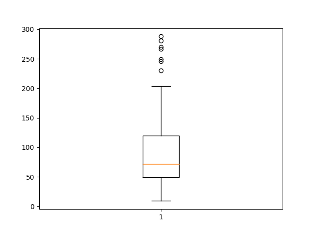

# LOCDB Log Analysis

## Usage

Either use the **Shorthand**: `sh analyze.sh <log-file>`
or manually perform the following steps:

1. Apply `prep.vim` to raw logfile by opening in `vim` and issuing `:source
   prep.vim`, then write and quit.
1. Run `python3 analyze.py < <prepocessed-log-file>` to compute all numbers.

## First Results

### Time to resolve a citation link

Based on the time between `SEARCH ISSUED` and `COMMIT PRESSED`. Sanity cut-off at 5 minutes.



```
N = 137
[Low, High] = [9, 288]
Quantile@25 = 49
Quantile@50 = 72
Quantile@75 = 120
Mean =  92.45255474452554
```
