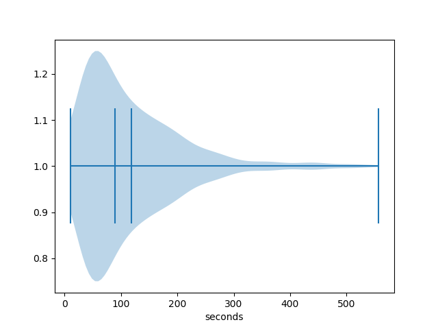
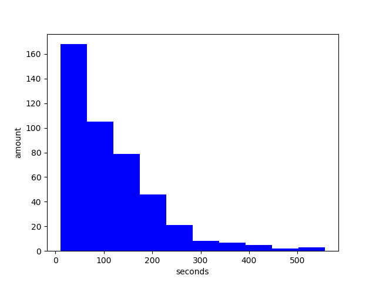

# LOCDB Log Analysis

## Usage

Use either the **shorthand**: `sh analyze.sh <log-file>`
or manually perform the following steps:

1. Apply `prep.vim` to raw logfile by opening in `vim` and issuing `:source
   prep.vim`, then write and quit.
1. Run `python3 analyze.py < <prepocessed-log-file>` to compute all numbers.

## First Results

### Time to Resolve a Citation Link

Based on the time between `SEARCH ISSUED` and `COMMIT PRESSED`. Sanity cut-off at 5 minutes.






```
N = 444
[Low, High] = [9.93, 557.195]
Quantile@25 = 49.385
Quantile@50 = 89.453
Quantile@75 = 159.185
Mean =  117.99254279279283
```

For more detailed, and potentially more up-to-date, results check [the results file](results.md) as well as the [results directory](results).
